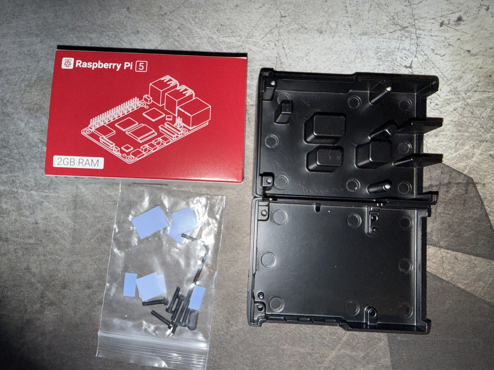
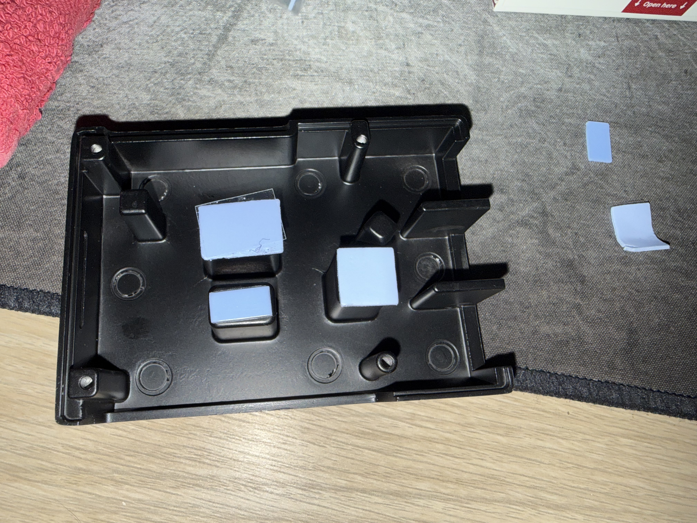
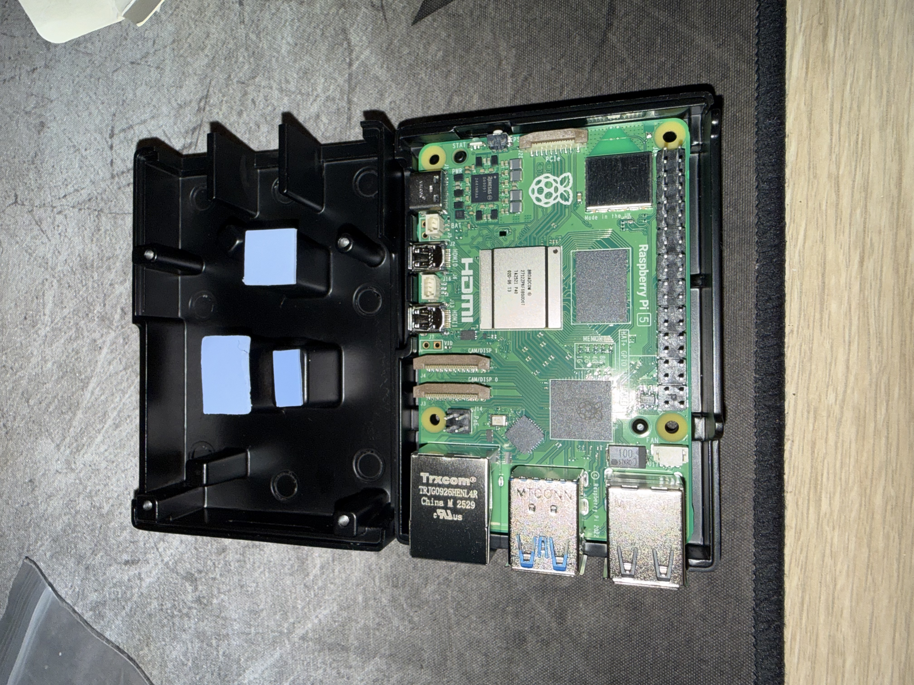
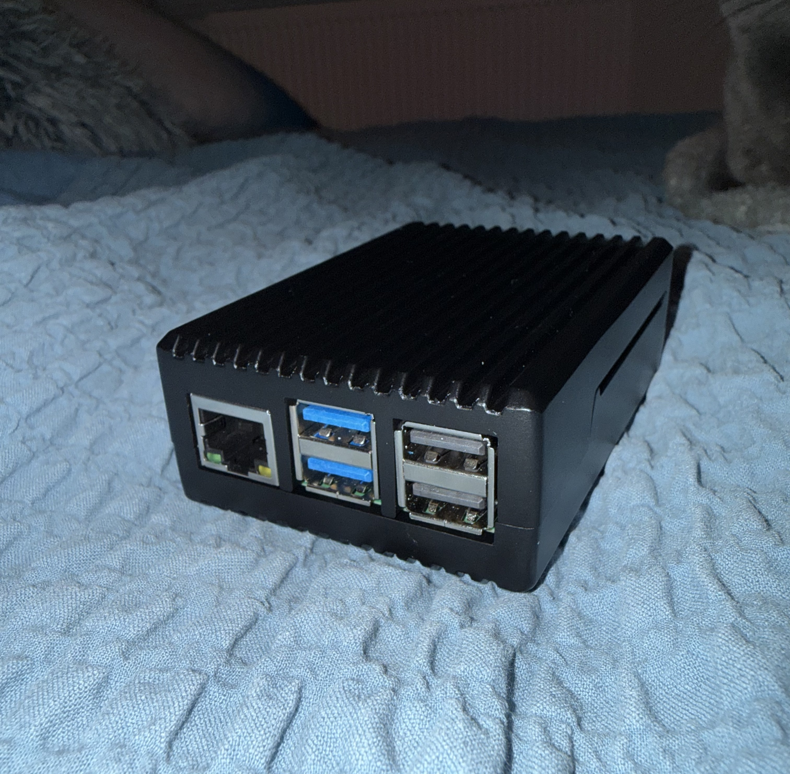
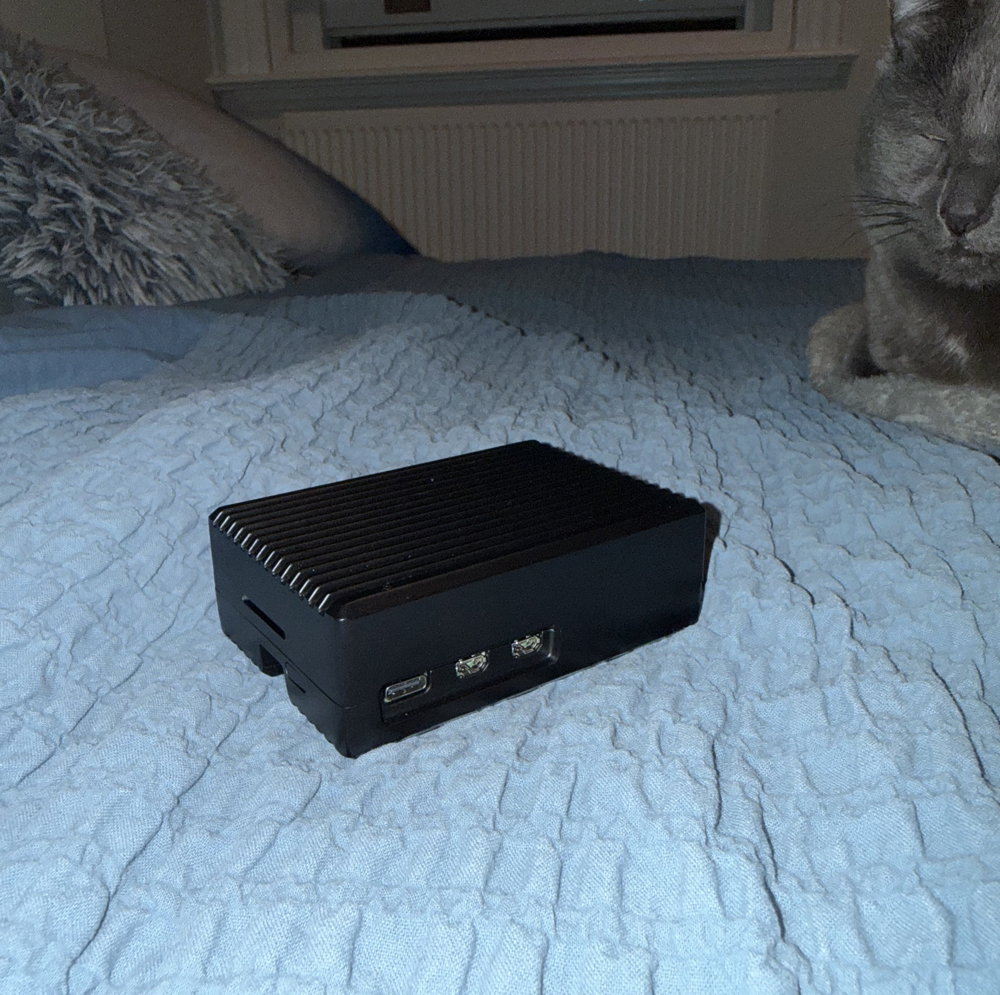

For a while now I've wanted a proper portable wardriving setup. Not just a laptop. I want a self-contained, pocketable device that I can throw in a bag and run headlessly in the field. After moving away from the Pwnagotchi approach (it is very neat but the features are not as extensive as Kismet), I decided to build something more capable around a Raspberry Pi 5.

This is part one: getting the hardware assembled and ready. The full stack isn't operational just yet. I'm still waiting on the Alfa AWUS036ACM WiFi adapter to ship, but the foundation is built.

## Hardware

Here's what I'm working with for this build:

- **Raspberry Pi 5** (2GB RAM)
- **Ridged Armour Case for Raspberry Pi 5** (PiHut) — passive aluminium heatsink case
- **Alfa AWUS036ACM** — on order, mt76x2u driver, dual-band AC
- **VK-172 GPS dongle** — for geotagging captures
- **microSD card** — boot/storage

The 2GB variant is going to be enough for Kismet passively capturing. Anything heavier (like potentially using hashcat) will be handled by my main machine anyway.

## Assembly

The Ridged Armour case is a two-part aluminium enclosure that doubles as a passive heatsink. The thermal pads make direct contact between the lid's internal pillars and the Pi's CPU and RAM, transferring heat through the metal body. No fan, no noise — which suits a field device well.

The hardware bag includes the thermal pads, screws, allen key, and a power button insert.

Assembly is straightforward. The thermal pads go on the inside of the lid — that's the half with the raised contact pillars. Each pad has protective film on both sides; peel one side to stick it to the pillar, leave the other side protected until you're ready to close up.

With pads on the lid, the Pi drops into the base tray with the ports aligned to the cutouts. Before closing, the power button insert slots into the side of the tray, bridging between the Pi's physical button and the case wall so you can still press it with the case closed.

Then it's just a case of lowering the lid down so the thermal pads land on the CPU and RAM, and driving in the four screws with the included allen key. Finger-tight only — it's aluminium and the threads will strip if you go heavy.

The whole thing takes about ten minutes, most of which is peeling film off thermal pads.

## What's Next

The case is built and the Pi is ready to flash. I'm going to hold off on the OS setup until the Alfa arrives, at which point I'll flash Raspberry Pi OS Lite, get Kismet installed from the official repos, configure gpsd for the VK-172, and wire the whole thing together.

Part 2 will cover the full software setup from flash to first capture.
